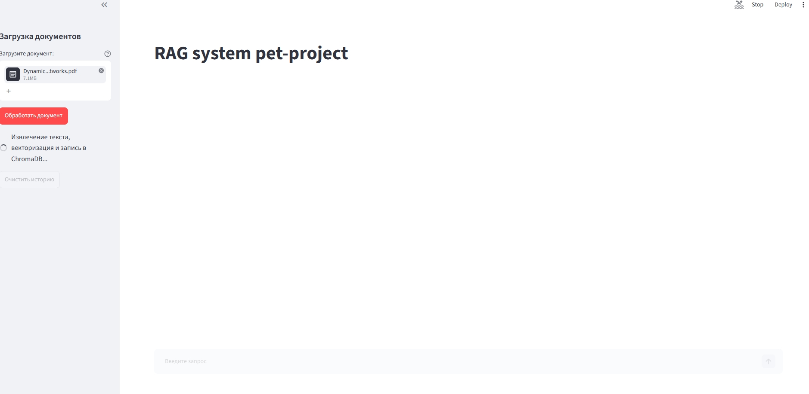

# 📑 RAG system pet-project

Простая RAG система с Fixed-size chunking, ChromaDB, бэкендом на FastAPI, фронтендом на Streamlit; вся архитектура упакована в контейнер Docker


---

## 🛠️ Стек технологий

* **База данных:** `ChromaDB` - локальная векторная база данных (HNSW, поиск по косинусному сходству).
* **Backend API:** `FastAPI`, - асинхронная обработка запросов.
* **Frontend UI:** `Streamlit` - интерфейс чат-бота с сохранением истории.
---

## 🚀 Инструкция по развертыванию и запуску

Откройте два параллельных терминала в VS Code и выполните команды:

* **Терминал 1 (FastAPI):**
  ```bash
  uv run uvicorn src.agent_system_plots.main:app --reload --port 8000
  ```
* **Терминал 2 (Streamlit):**
  ```bash
  uv run streamlit run src/agent_system_plots/app.py
  ```

Или воспользуйтесь контейнером Docker и командой
  ```bash
  docker compose up --build
  ```

---

